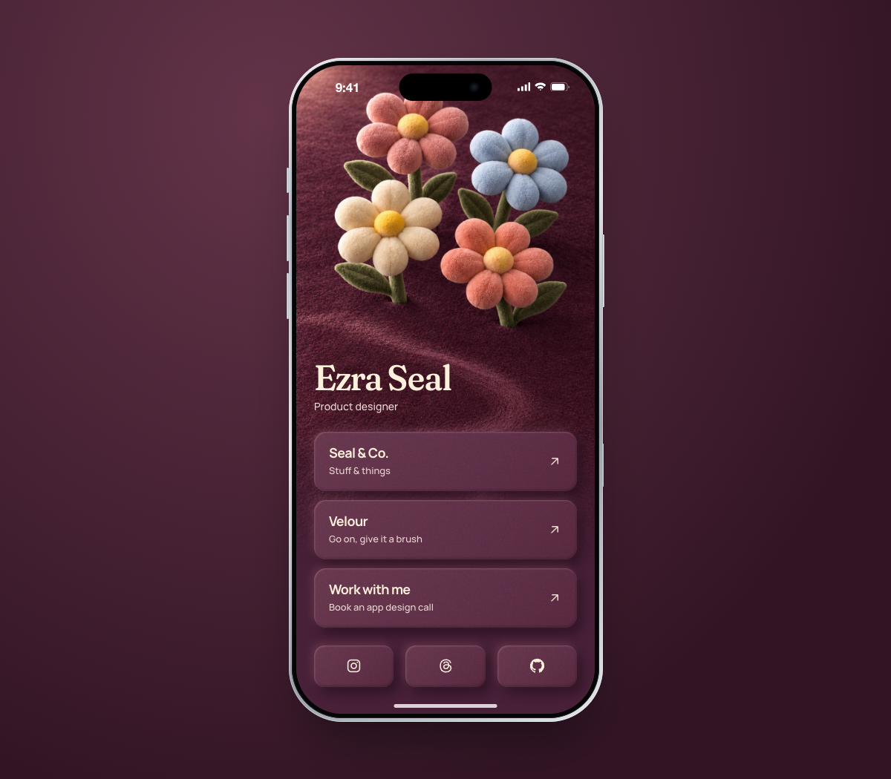

# Links

I wanted a links page that felt like mine, so I made one and kept playing with it. Flowers, soft buttons, a little movement. This is where it landed.

The content lives in one file, which makes it easy to try a different version. If it gives you an idea for your own page, I’d love to see it.

[Visit the page](https://sealandco-links.vercel.app)



## Make it yours

Open this repository in your coding assistant and paste:

> Help me make a version of this links page. Ask me for my name, short description, links, site address, and the visual direction I want. Update `site/links.json` (including `plannedUrl`), then customize the typography, colors, and artwork to suit me. Keep the working HTML links, keyboard access, reduced-motion support, mobile layout, and desktop phone frame. Keep the page usable without JavaScript. Run `node site/tools/build.mjs` after changing the content, and check the result on mobile and desktop. Show me a local preview before publishing anything.

## Or work directly

No framework or install step. You’ll need Node.js to generate the page and Python to serve it locally.

```sh
node site/tools/build.mjs
python3 -m http.server 4173 --directory site
```

Open [localhost:4173](http://localhost:4173).

Edit `site/links.json` for the name, description, links, and socials, then run the build command again. The page lives in `site/`; its styles are in `site/style.css` and artwork in `site/assets/`.

The type is Fraunces and Manrope. The flowers are part of a static image, with a small 2D deformation when dragged. They aren’t 3D models.

To host it, run `node site/tools/build-public.mjs` and publish `site/public/` to any static host. That folder contains only the page and the assets it uses.

For the browser checks, see [testing](site/docs/testing.md).

MIT licensed. The fonts carry their own [OFL licenses](site/assets/fonts/).
